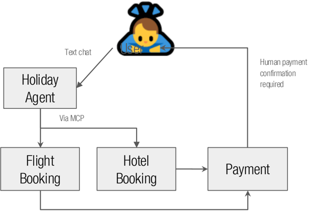

## Q4 Architecture Kata

https://www.flickr.com/photos/alper/10535915873/

What Is A Kata?

https://flickr.com/photos/photosvega/8372853889/

## CodeKata

Recent Posts

How do you to be a great musician? It helps to know the theory; and to understand the mechanics of greatness comes practicing; applying the theory over and over aBain, feedback to better every get from using Bet

How do you to be an All-Star sports person? Obviously fitness and talent help. But the great athletes spend hours and hours every practicingget day.

But in the software industry we take developers trained in the theory and throw them straight in to the deepend, working on a projcct. Its like a group of fit kids and them that have four quarters to taking telling ' they

## What do we want you to do?

You'll be presented with a realistic example of a company who want you to define an architecture for them

We want you to come back with your proposal for how the system should be built

We want you to pay special attention to how the use of AI tooling could help enhance the solution, both for the company, and also for the companies customers.

## The Problem

## Introducing MobilityCorp

## Who are MobilityCorp?

MobilityCorp provide short-term rental for last-mile transport!

- Electric scooters
- eBikes
- Electric cars and vans

Our customers sign up and can rent available vehicles

MobilityCorp operates in multiple locations, mostly in city locations but is increasingly offering its car and van rental to more suburban locations

We want you to come up with a new architecture for MobilityCorp, incorporating AI functionality where appropriate

## Booking

Cars and Vans can be booked up to 7 days in advance, and are booked for a specific duration.

Bikes and scooters can be booked up to 30 minutes in advance, but the booking is open ended (they can be kept for up to 12 hours).

## Payment

Customers pay per minute for rental

Fines are applied for vehicles being returned to the wrong location, or returned late

Assume all rental vehicles have GPS trackers on them

Cars and Vans can be remotely disabled if needed

## The Vehicles

All transport vehicles contain GPS trackers so we know where they are at all times

All vehicles can be remotely unlocked by MobilityCorp

It is expected that a customer uses an NFC-capable smartphone app to lock and unlock the vehicles

## On Return

Cars, Vans, scooters and bikes have to be returned to designated parking spots at the end of their rental

We need proof of their return - customers need to submit photos of the returned vehicle Cars and Vans need to be plugged in to the EV charger at their designated parking spot when returned We ask the customer to provide feedback - this could include information about things like vehicle faults

## Bike and Scooter charging and distribution

Bikes and scooters have to have their battery packs swapped out with fully charged packs - this is done by company staff who visit the parking bays in their vans.

Our staff need to know which bays need to be visited

They also help move scooters and bikes around so they are available at popular spots

## Biggest business challenges

Our customers keep complaining that the right vehicles aren't in the right places!

- -How do we know when people will want to use the vehicles?
- -Can we anticipate customer needs?

We also have problems with our electric vehicles running out of charge

- -Can we work out how to prioritise which vehicles to switch out batteries? (for bikes and scooters)

We want our customers to use our services more frequently

- -Right now, most of our customers just use them on an ad-hoc basis we'd like more of them to rely on our fleet for regular trips like daily commutes

## Things we expect to see….

## Deliverables

- -Overview: a short narrative describing how the team used AI to solve mobility corp's problems
- -Diagrams: comprehensive and targeted views for each use of AI
- -ADRs for AI-related implementations, including trade-off analysis
- -(optional) Pertinent implementation details
- -(for semi-final teams) Fiveminute video describing the team's approach

## Judges Criteria

- -Innovative use of Generative AI in solution(s)
- -Suitability of the solution given the constraints
- -Provide appropriate levels of detail
- -Dealing with uncertainty in the world of AI technology
- -Do the architectural characteristics of the additions match the existing architecture?
- -Validation and verification of AI results

Our judges can't speak to you individually…

…so you need to communicate with them via your deliverables

## Communication is key diagrams - types, level of detail, completeness

<!--  -->

'Successful communication is the art and science of sharing or exchanging ideas and information,... resulting in shared understanding.' - Jacqui Read

<!--  -->

www.oreilly.com/library/view/communication-patterns/9781098140533/

## Document your decisions!

ONLY

ONLY

## architecture decision records

## Judges Criteria

diagrams - types, level of detail, completeness

<!--  -->

'The goal of a diagram is to convey a clear and shared understanding of the architecture'

- Neal Ford

## Pictures!

We don't need complex diagrams, we need easy to understand diagrams

You can go a long way with boxes, arrows and words

If you use different shapes to mean different things, please provide a key!

<!--  -->

## Dealing with uncertainty in AI

AI is changing FAST - how are you going to deal with the fact that the best models or providers today might not be the best tomorrow?

How would you handle your model provider changing prices on you?

What might happen if the provider you used suddenly shut down?

## Does it work?

We want to understand how you will confirm that your use of AI is actually working

Verifying functionality of deterministic solutions is easy - but GenAI functionality tends to be nondeterministic!

How will you know if your AI-driven functionality starts misbehaving once in production?

## Meet the Judges

## Andrew Harmel-Law

Andrew Harmel-Law is an overenthusiastic Tech Principal for Thoughtworks.

They specialize in DDD, Java/JVM techs, agile delivery, build tools and automation, and org design. They love the efficient delivery of large-scale software solutions, and understands that people, architecture, process, and tooling all have key roles to play in achieving this.

Andrew's experience spans many sectors including government, banking, and eCommerce. They have a passion for open source software and its communities.

The author of 'Facilitating Software Architecture' Andrew shares his experiences through mentoring, blogging, and speaking at/organizing conferences.

<!--  -->

## Gayathri Mohan

Gayathri Mohan is currently leading large scale enterprise modernisation programs at StatusNeo as their Sr.Director of Enterprise solutions in the UK. She's the author of Full Stack Testing (O'Reilly) and coauthor of the ebook Perspectives of Agile Software Testing. Previously, she was part of the chief AI officer's leadership team that built and executed the global AI strategy at Thoughtworks.

<!--  -->

## Kent Beck

Kent Beck is a programmer, creator of Extreme Programming, pioneer of software patterns, coauthor of JUnit, rediscoverer of test-driven development, and observer of 3X: Explore, Expand, and Extract. Beck is also alphabetically the first signatory of the Agile Manifesto. He lives in San Francisco.

<!--  -->

## If you want some inspiration?

## The Katalog

https://github.com/thekatalog

READ THE ARCHITECTURE

## KATASLOG

## How To Submit Your Problem

Create a GitHub repo for your problem and submit it on the next slide

Please include all documentation, visuals in the repo!

Make sure to have a simple readme for the repo so our judges can navigate what you have shared with us

## Kata Schedule

- All teams must submit this Google Form (https://forms.gle/wuFjEvkaD8TWkMPX8) by Wednesday, October 15 at 12pm ET to participate
- Solutions are due in your GitHub repo by 11:59pm ET Thursday, October 23
- Semifinalists will be announced at the second event on Wednesday, November 5
- Semifinalist video presentations due by 11:59pm ET Sunday, November 9
- Winners are announced at the final event on Thursday, November 13