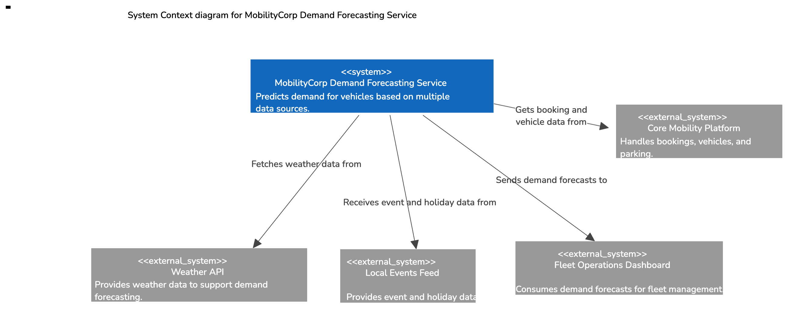
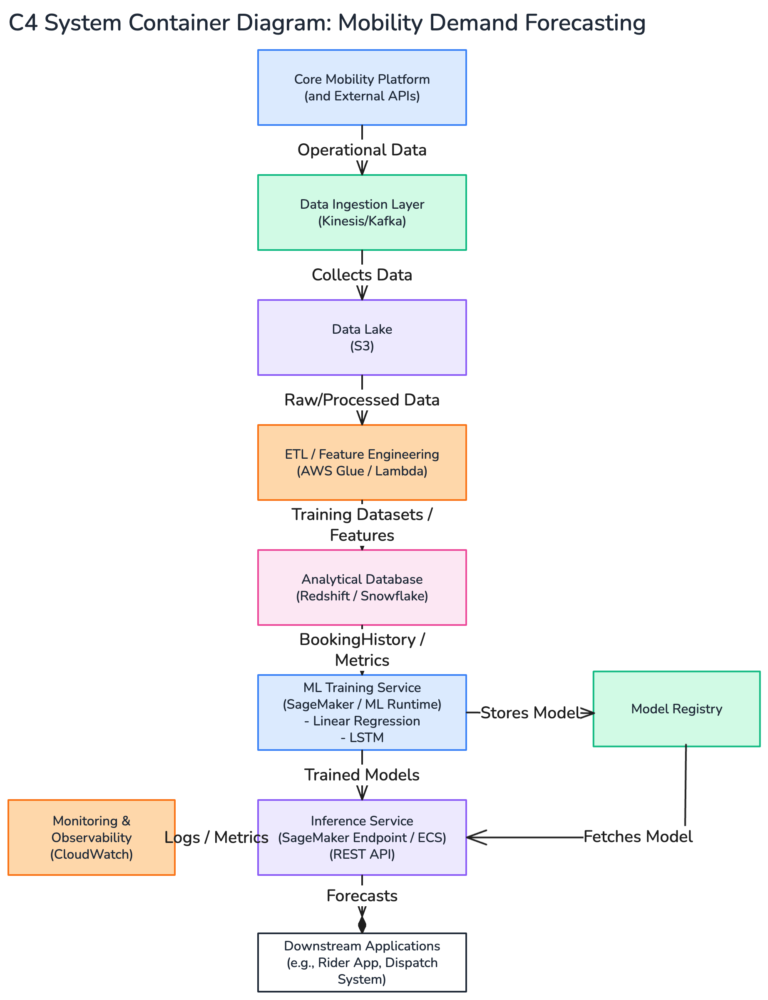
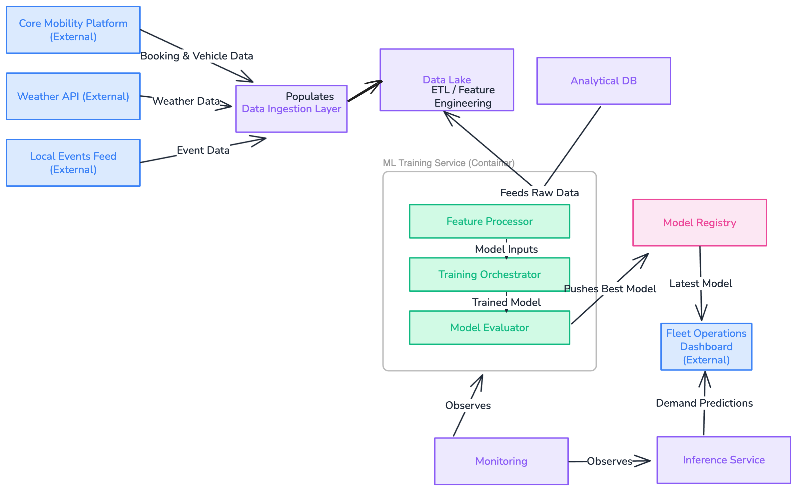

## MobilityCorp – Demand Forecasting Solution Architecture

Date: October 2025

Prepared by: BRINUS – Prashant, Joao, Khaled, Rafi

### 1. Problem Statement

MobilityCorp’s customers frequently report that the right vehicles are not available where and when they need them. This results in customer dissatisfaction, reduced utilization rates, and suboptimal fleet operations. The business needs a predictive capability to anticipate customer demand for vehicles based on temporal, spatial, and contextual factors (e.g., time of day, day of week, weather, and local events) so the fleet can be proactively distributed to match expected demand.

### 2. Scope

This solution addresses MobilityCorp’s decision and analytics requirements by implementing a demand forecasting capability that operates alongside the existing operational booking and fleet management systems. The scope includes data ingestion, analytical modeling, and machine learning-based forecasting using multiple linear regression and LSTM approaches.

### 3. Assumptions

The core business application (booking engine, NFC vehicle control, returns, charging, etc.) is already implemented and deployed on the target cloud platform.

The operational database (Bookings, Vehicles, Parking, Users) is available through APIs or CDC feeds.

The cloud environment provides standard managed services for compute, storage, observability, and orchestration (e.g., AWS S3, ECS, SageMaker, CloudWatch).

AWS is used for illustration, but the architecture remains cloud-agnostic and can be migrated to Azure or GCP with minimal change.

### 4. Architecture Decision Records (ADRs)

ADR-001: Cloud-Native Resilience and Fault Tolerance

The solution shall be deployed on a cloud platform that provides out-of-the-box resilience, observability, autoscaling, and operational excellence through managed services.

ADR-002: Separation of Operational and Analytical Data

Operational data shall be periodically replicated into an analytical data store for training without impacting transactional performance.

ADR-003: Model Explainability and Flexibility

Forecasting will use two complementary models – Multiple Linear Regression for transparency and LSTM for nonlinear temporal factors.

ADR-004: Cloud-Agnostic Implementation

All services and components will use standard APIs, containers, and open frameworks (e.g., Python, TensorFlow, REST) for portability.

ADR-005: Cloud Portability Strategy

While AWS-managed services like SageMaker and Redshift are used for managed scalability, the solution maintains portability via open standards. Models, data formats, and containerized workloads are cloud-agnostic, enabling redeployment on Azure ML or GCP Vertex AI with minimal change.

### 5. Solution Architecture

The architecture integrates data ingestion, transformation, model training, and serving layers. It is modular, resilient, and scalable, aligning with cloud-native best practices.

We will take a transformative approach to 1st analyze multiple linear factors that can affect demand: Time of the day, day of the week, and events.
After achieving success and some level of maturity, we will switch to LSTM employing nonlinear temporal dependencies such as weather. 
We do not think that there is a direct use case for Gen-AI in these requirements.

**5.1 C4-System Context Diagram**

At the center is the Demand forecasting service that takes input from local events, core MobilityCorp platform and (later on) Weather API and provides demand forecasting about how many vehicles of each type are needed at what location and at what time.

#### 5.2 Multiple Linear Regression on AWS

This model predicts expected demand per location/hour based on linear and interpretable factors like day of week, hour of day, local events, and recent booking volume.

S3: Training data source

AWS Glue: Feature engineering and transformation

SageMaker (Scikit-Learn Container): Training and deployment

CloudWatch + Lambda: Scheduled retraining triggers

#### 5.3 LSTM on AWS

The LSTM model captures nonlinear temporal dependencies such as weather variations, holiday effects, and recurring event-driven spikes.

S3: Sequential data storage

SageMaker (TensorFlow Container): Model training with sliding windows

Model Registry: Version control and lifecycle tracking

Endpoint Deployment: Autoscaling inference API via SageMaker or ECS

#### 5.4 C4- System Containers Diagram

Note: even though the diagram uses AWS native services like redshift and SageMaker, it is possible through ways like containerization and ANSI SQL to make them portable with some reasonable effort. This is a trade-off between vendor lock-in and well-defined architecture that is documented in ADR.

#### 5.5 C4-System Component Diagram

The system Component diagram shows the actual logical components of the proposed architecture

#### 

#### 5.6 Scalability, Availability, and Fault Tolerance

| Aspect          | Approach                                                                            |
|-----------------|-------------------------------------------------------------------------------------|
| Scalability     | Stateless containers, autoscaling policies, horizontally partitioned data stores.   |
| Availability    | Multi-AZ deployment for all stateful components, load-balanced inference endpoints. |
| Fault Tolerance | Retry logic, dead-letter queues, idempotent model jobs.                             |
| Monitoring      | CloudWatch alerts for latency, accuracy drift, and pipeline health.                 |

#### 5.7 Security and Compliance

Data encrypted in transit (TLS 1.3) and at rest (KMS-managed keys).

IAM-based least privilege access to training and inference services.

CloudTrail logs maintained for auditing and compliance.

#### 5.8 Portability

The architecture relies on open frameworks (Python, TensorFlow, scikit-learn) and containerized workloads, allowing deployment on Azure ML, GCP Vertex AI, or Kubernetes without redesign.

### 6. Expected Outcomes

Improved vehicle placement accuracy and utilization.

Reduced customer wait times and unfulfilled bookings.

AI-driven insights into demand trends and influencing factors.

A resilient, cloud-native, explainable architecture ready for production scaling.