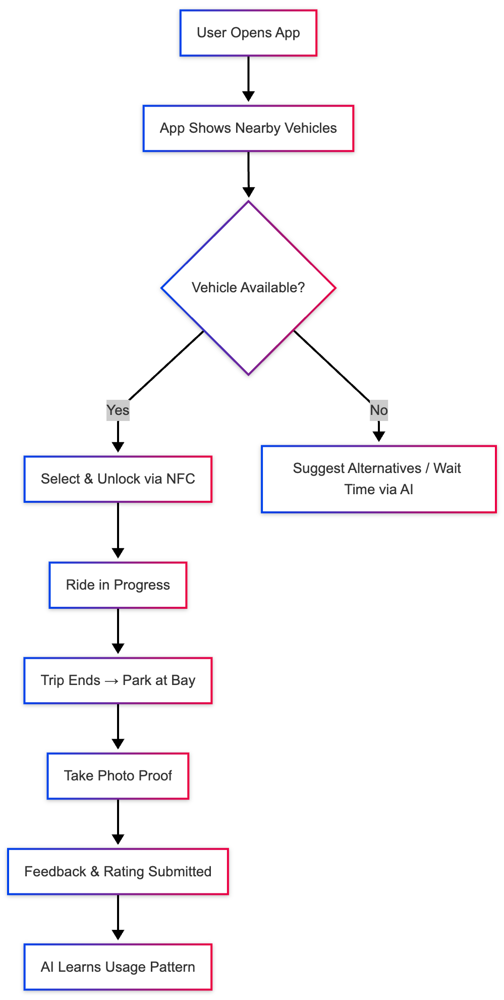
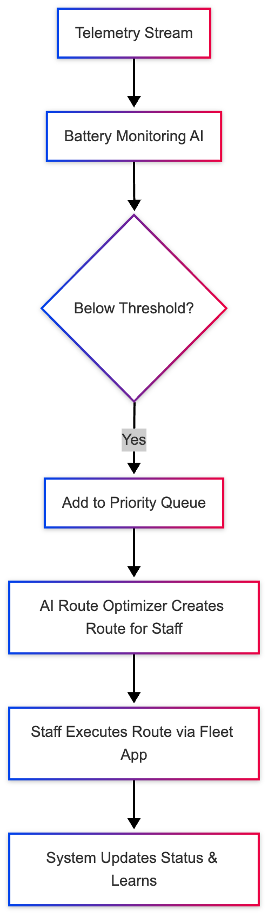
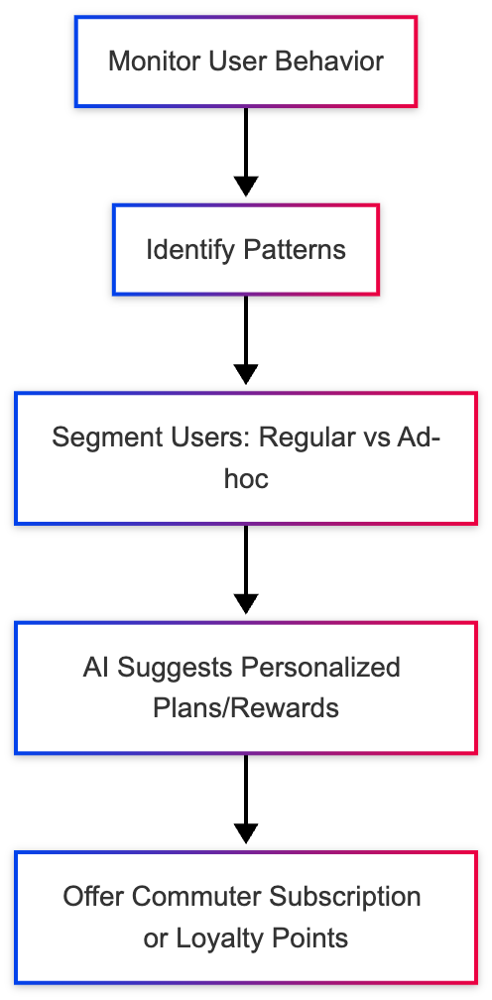

# MobilityWeave Architectural Document: Preamble

1. Application Context

## Context

MobilityCorp provide short-term rental for last-mile transport!

- Electric scooters
- eBikes
- Electric cars and vans

Our customers sign up and can rent available vehicles

MobilityCorp operates in multiple locations, mostly in city locations but is increasingly offering its car and van rental to more suburban locations

We want you to come up with a new architecture for MobilityCorp, incorporating AI functionality where appropriate

### Booking Rules

- Cars and Vans:
  - Bookable up to 7 days in advance
  - Fixed duration rentals

- Scooters and Bikes:
  - Bookable up to 30 minutes in advance
  - Open-ended rentals (up to 12 hours)

### Payment Model

- Per-minute billing
- Fines for:
  - Late returns
  - Returning vehicles to incorrect locations

## Business Challenges

- Vehicles are often not available where customers need them
  - Need to predict demand and anticipate customer needs

- EVs frequently run out of charge
  - Need to prioritize battery swaps and charging schedules

- Most usage is ad-hoc
  - Desire to increase regular usage (e.g., daily commutes)

## Personas

| Persona                                      | Description                                                                                 | Goals                                                                               | Pain Points                                                                         | Opportunities for AI                                                                             |
| -------------------------------------------- | ------------------------------------------------------------------------------------------- | ----------------------------------------------------------------------------------- | ----------------------------------------------------------------------------------- | ------------------------------------------------------------------------------------------------ |
| **Sofia – Urban Commuter (Customer)**        | 28, marketing analyst, lives downtown. Uses scooters/eBikes for short commutes.             | Quick, reliable access to nearby vehicles. Predictable availability near home/work. | Often finds no scooters near her in the morning. Sometimes battery is low.          | Predictive demand models to position vehicles; personalized recommendations for recurring trips. |
| **Carlos – Suburban Worker (Customer)**      | 42, project manager, suburban area. Uses electric vans occasionally.                        | Plan weekend trips or home improvement transport. Reliable booking ahead.           | Vans unavailable at desired suburban stations. Long trip times reduce availability. | Demand forecasting for suburban use; route optimization; dynamic fleet balancing.                |
| **Maya – Fleet Operator (Staff)**            | 33, MobilityCorp field ops. Drives van to swap scooter batteries and redistribute vehicles. | Optimize daily routes and time. Know which vehicles need charge or relocation.      | No prioritization of which vehicles to attend first. Manual planning.               | AI-assisted route optimization; predictive battery failure alerts.                               |
| **Andre – Operations Manager (Staff)**       | 45, manages fleet and city operations.                                                      | Ensure balanced distribution and minimize idle vehicles.                            | Data overload; decisions are reactive.                                              | AI dashboards for predictive insights and anomaly detection.                                     |
| **MobilityCorp AI System (Virtual Persona)** | Intelligent layer that learns from telemetry, bookings, and user behavior.                  | Optimize utilization, anticipate demand, enhance user experience.                   | Data silos, inconsistent feedback loop.                                             | Autonomous recommendations, demand prediction, and energy optimization.                          |

## User Flows

### 1. Vehicle Booking Flow

AI touchpoints: demand prediction, route recommendations, auto-suggest alternate vehicles, feedback analysis.

### 2. Battery Swap / Fleet Maintenance Flow

AI touchpoints: predictive maintenance, optimal route planning, prioritization algorithm.

### 3. Customer Retention Flow

AI touchpoints: behavioral segmentation, recommendation engine, retention optimization.

## Product Backlog Building (PBB) Canvas Summary

| **Block**                 | **Content**                                                                                                                                                                                                                                                                                                                                                                                                         |
| ------------------------- | ------------------------------------------------------------------------------------------------------------------------------------------------------------------------------------------------------------------------------------------------------------------------------------------------------------------------------------------------------------------------------------------------------------------- |
| **Product Vision**        | Enable MobilityCorp to deliver reliable, AI-driven mobility services — ensuring the right vehicle, at the right place, at the right time.                                                                                                                                                                                                                                                                           |
| **Main Features (Epics)** | 🚗 **Smart Demand Forecasting** – ML-driven demand prediction per location/time. 🔋 **Battery Optimization** – Predictive charge management & routing. 🗺️ **Fleet Rebalancing Assistant** – AI route planner for redistribution. 🧠 **Customer Engagement AI** – Personalized commute recommendations & loyalty engine. ⚙️ **Ops Dashboard** – Predictive analytics and decision support for managers. |
| **User Stories Examples** | - As *Sofia*, I want to see available scooters near me in the morning so I can commute quickly. - As *Maya*, I want the system to show which batteries to replace first so I can plan my route efficiently. - As *Andre*, I want to see tomorrow’s predicted vehicle demand so I can allocate resources proactively.                                                                                          |
| **AI Use Cases**          | - Time-series forecasting for demand prediction (Prophet / LSTM / SageMaker Forecast). - Predictive maintenance (battery degradation model). - Recommender systems (personalized commute plans). - Natural language sentiment analysis on user feedback.                                                                                                                                                   |
| **Metrics / KPIs**        | Fleet utilization %, downtime hours, average wait time per customer, # of low-battery incidents, retention rate increase.                                                                                                                                                                                                                                                                                           |
| **Risks / Constraints**   | Data sparsity, non-deterministic AI behavior, privacy compliance (GDPR), multi-city scaling.                                                                                                                                                                                                                                                                                                                        |
| **Validation Strategy**   | A/B tests for recommendations, shadow-mode testing for predictive models, human-in-loop feedback review.                                                                                                                                                                                                                                                                                                            |

## Functional Requirements

### Vehicle Management

- GPS tracking for all vehicles
- Remote unlock capability
- NFC-based smartphone app for locking/unlocking
- Remote disable capability for cars and vans

### Booking System

- Support for advance and short-term bookings
- Real-time availability tracking
- Duration-based booking logic per vehicle type

### Return Process

- Mandatory return to designated parking spots
- Photo proof submission by customers
- EVs (cars and vans) must be plugged into chargers
- Customer feedback collection (including fault reporting)

### Charging and Distribution

- Battery swap alerts for bikes and scooters
- Staff routing for battery swaps and vehicle redistribution
- Identification of high-demand locations

## 5. Non-Functional Requirements

- Scalability: Support for growing fleet and geographic expansion
- Localization: Multi-language and multi-currency support
- Security: Secure access, data protection, and remote control features
- Availability: High uptime and reliability for booking and vehicle control
- Performance: Real-time responsiveness for booking and tracking

## 6. Constraints

- All vehicles must be GPS-enabled
- Customers must use NFC-capable smartphones
- Vehicles must be returned to designated spots with photo proof
- EVs must be charged upon return
- Staff must manage battery swaps and vehicle redistribution manually

## 7. Assumptions

- Customers have access to smartphones with NFC
- Staff are equipped with vans for redistribution and battery swaps
- Vehicles are equipped with necessary hardware for remote operations