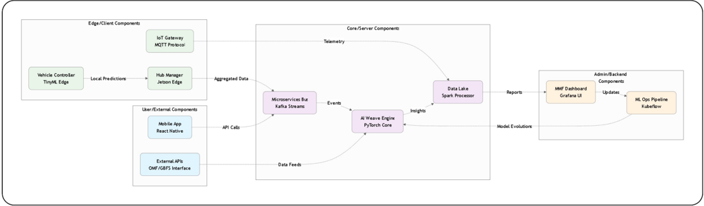
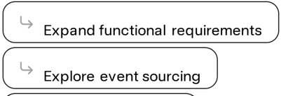

## 2. Architectural Design Foundations

## Architectural Restrictions

- Regulatory Compliance: GDPR for EU data privacy (anonymized federated learning mandatory); OMFIGBFS interoperability enforced for MaaS APIs; EU Green Deal standards for EV fleets (30% emission tracking required) .
- Technological Constraints: No proprietary lock-in\_open-source core (Py Torch/Flower); edge devices limited to low-power (TinyML &lt;IW); 5G V2X mandatory for telemetry; but fallback to 4G for rural pilots.
- Scalability Limits: Initial deployment capped at 1.5K units (3 countries); fractal scaling via Kubernetes , but no more than 1OK concurrent streams without sharding.
- Budget/Deployment: Greenfield capex €15OM; cloud-agnostic (AWSIGCP hybrid); no custom hardware beyond Jetson edges .

## Functional Requirements

High-level capabilities derived from PBB PBIs, focusing on core Al orchestration and MaaS flows.

| FR- 01   | Multi-Modal Routing    | Generate predictive trip tapestries (e.g., scooter-to-van chains) with <5s latency; integrating GTFSIOMF data.   | Must   |
|----------|------------------------|------------------------------------------------------------------------------------------------------------------|--------|
| FR- 02   | Predictive Rebalancing | Forecast demand and auto-queue vehicle /hub redistributions based on heatmaps (e.9., 30% utilization boost) .    | Must   |
| FR- 03   | Equity Optimization    | Apply dynamic subsidies and audits for non - citizen /underserved access (e.g., 40% inclusion metrics)           | Must   |
| FR 04    | Edge Maintenance       | Prioritize battery swaps via loT anomaly detection (e.9., 40% fewer depletions)                                  | Should |
| FR- 05   | Habit Personalization  | Learn user patterns for mode nudges and green credits (e.g., 35% repeat usage).                                  | Should |

## Non-Functional Requirements

Quality attributes ensuring resilience, performance; and sustainability in a 1OOK-unit global scale.

| Performance     | Real-time predictions; handle 1M daily events.               | <3s latency (p95); 95% uptime (SLA).                 |
|-----------------|--------------------------------------------------------------|------------------------------------------------------|
| Scalability     | Horizontal auto- scaling for fractal growth.                 | Support 1Ox user spike; Kubernetes <5s spin-up. pods |
| Reliability     | Fault-tolerant edge-cloud sync; no single of failure _ point | 99.9% availability; automated failover in <1 min.    |
| Security        | End-to-end encryption; differential privacy for ML.          | GDPR/CCPA compliant zero-trust                       |
| Maintainability | MMF auto- evolutions; modular microservices _                | <20% code churn/year; CI/CD with 80% test coverage.  |
| Sustainability  | Energy-efficient edge Al; carbon tracking.                   | <10% fleet energy waste; 30% emission reduction via  |

optimizations

## Architectural Mechanisms

Cross-cutting enablers for requirements , implemented via design patterns and tools .

| Event-Driven Communication   | Asynchronous streams for telemetry and nudges.      | Apache Kafka; MQTT for edge.                      |
|------------------------------|-----------------------------------------------------|---------------------------------------------------|
| Data Privacy & Federation    | Anonymized aggregation without central hoarding .   | Federated Learning (Flower); Differential Privacy |
| Resilience & Monitoring      | Circuit breakers for failures; predictive logging _ | Istio service mesh; Prometheus /Grafana.          |
| Integration & API Gateway    | Standardized handoffs for MaaS:                     | OMFIGBFS APIs; Kong Gateway                       |
| Deployment & Orchestration   | Containerized _ auto-scaling pipelines _            | Kubernetes; GitOps with ArgoCD .                  |

## Architectural Styles Candidates

Evaluated for fit with MaaS demands (scalability; Al integration); selected hybrid for optimal balance.

| Microservices             | Independent scaling; fault isolation for edgelcloud layers.   | Overhead in inter-service calls .   | High_core for fractal modularity (chosen)   |
|---------------------------|---------------------------------------------------------------|-------------------------------------|---------------------------------------------|
| Event-Driven Architecture | Real-time reactivity for predictions /rebalancing .           | Complexity in state management.     | High _ complementary to microservices       |
| Serverless                | Cost-efficient for sporadic surges (e.9., tourist peaks) .    | Vendor lock - in risks; cold starts | Medium_hybrid for non-critical lambdas      |
| Monolithic                | Simpler initial dev for pilots .                              | Poor scaling for global fleets .    | Low_avoided for greenfield ambition _       |

Primary: Microservices + Event-Driven hybrid, enabling 30% efficiency gains over monolithic peers.

## Mermaid UML Components Diagram

This component diagram illustrates key architectural components interfaces, and dependencies , focusing on the Al Weave Engine as the central orchestrator .

more concise tables